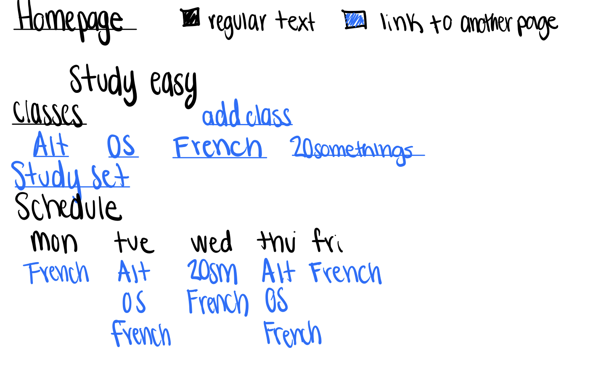
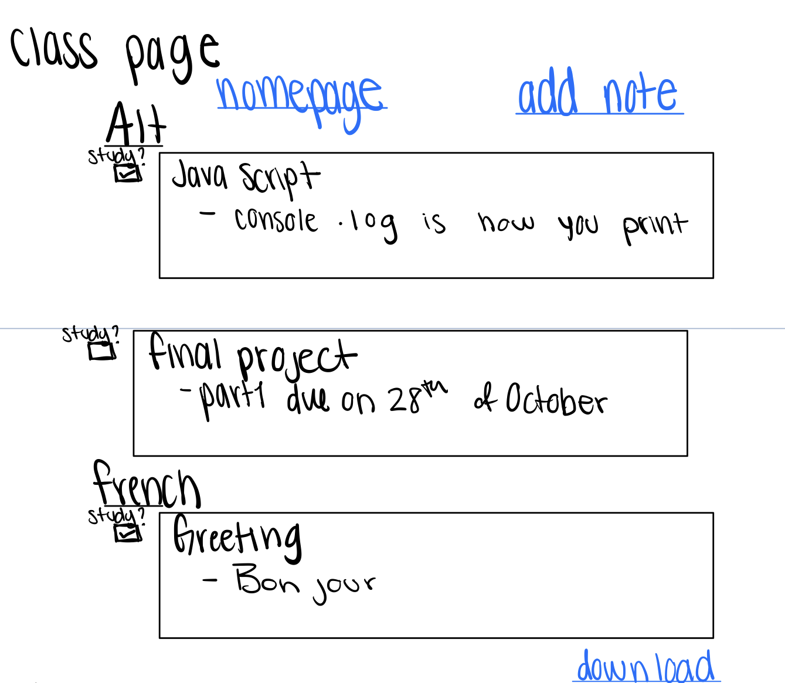
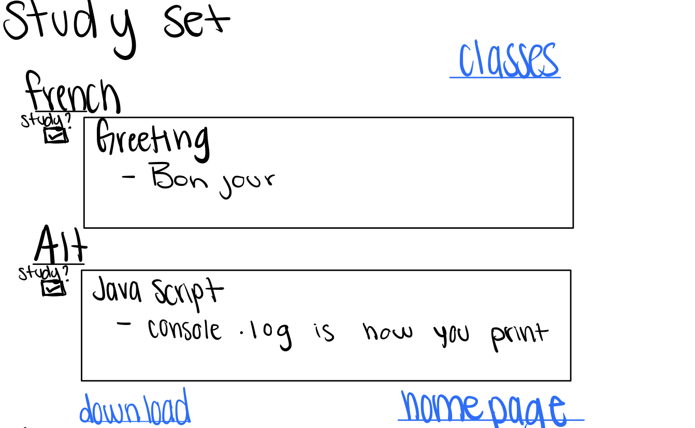
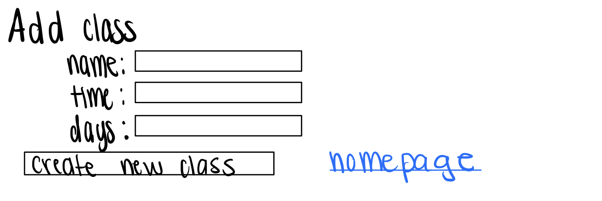
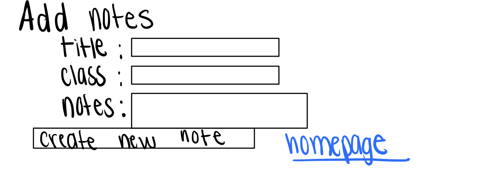
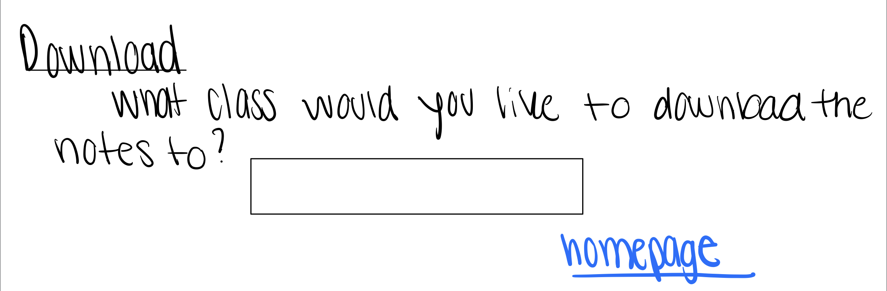
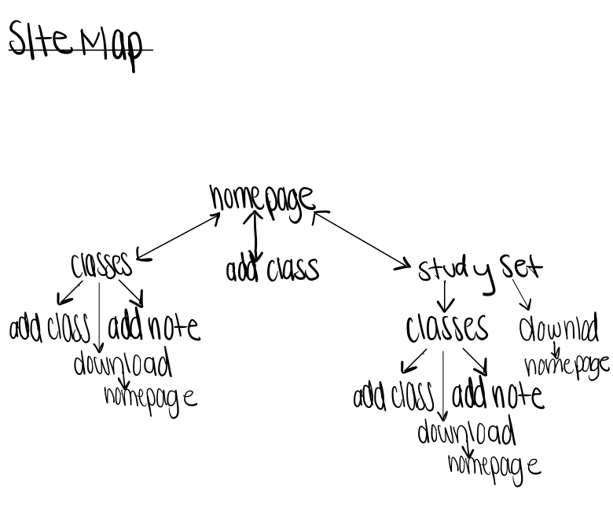

# Study Easy 


## Overview

Taking notes can be hard to organize. Having one notebook including everything you need makes it imposible to keep track of your notes and for what class they are for. This is why i invented Study easy! Keep track of your notes and don't waits paper!

Study easy is a web app that allows users to log in and have all their notes organized on one webpage. you can log multiple classes and take notes within each class. You can also keep track of what you need to study by cheking them off a list! Users will also be able to download their notes into a txt file.


## Data Model


The application will store Users, Notes and Classes

* users can have many classes (via references)
* each class can have more than one note (by embedding)


An Example User:

```javascript
{
  username: "isabellaMasiero",
  hash: // a password hash,
  notes: // an array of references to notes documents
}
```

An Example Class with Embedded notes:

```javascript
{
  user: // a reference to a User object
  name: "AIT",
  time: 3, //military time of class
  days: ["monday","tuesday"],
  note: [
    { title: "javascript", class: "AIT", bodyOfNotes: "- printing in js is: console.log ", checked: true},
    { title: "final project", class: "AIT", bodyOfNotes: "- part1 is due on the 28th of October ", checked: false},
  ],
  createdAt: // timestamp
}
```


## [Link to Commented First Draft Schema](db.js) 


## Wireframes

/home - home page to see all classes and notes



/classes - page for showing all classes and notes



/study - page to see all notes that need to be studied 



/classes/addClass - page for adding class



/classes/addNote - page for adding notes to a class



/download - page to turn notes into txt file



## Site map




## User Stories or Use Cases

1. as non-registered user, I can register a new account with the site
2. as a user, I can log in to the site
3. as a user, I can create a new class
3. as a user, I can create a new note
4. as a user, I can view all of the classes I've created in a single list
5. as a user, I can view all of the notes I've created in a single list
6. as a user, I can view all of the notes I've checked to study in a single list
7. as a user, I can create a txt of the notes I've created
8. as a user, I can check notes as need to study in an list of notes
9. as a user, I can view all the classes I've created in a schedule

## Research Topics

* (5 points) Integrate user authentication
    * I'm going to be using passport for user authentication
* (3 points) Embeded Mongodb Collection
    * Using collections within collections in MongoDB and manipulating them though the site; Quite complicated so I assigned 4 points;
* (2 points) Using HTML to download filt
    * Having the user be able to download their notes from a like fully in HTMl; A little difficult so 2 point;

5 points total out of 8 required points


## [Link to Initial Main Project File](app.js) 


## Annotations / References Used

1. [passport.js authentication docs](http://passportjs.org/docs)
2. [Embeded collections](https://www.geeksforgeeks.org/mongodb-embedded-documents/) 
3. [File Download](https://pqina.nl/blog/how-to-prompt-the-user-to-download-a-file-instead-of-navigating-to-it/)
